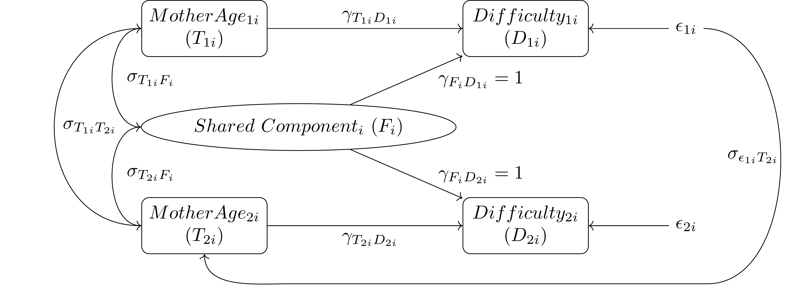

<!-- This is the format for text comments that will be ignored during renderings. Do not put R code in these comments because it will not be ignored. -->

```{r, setup, echo = FALSE}
knitr::opts_chunk$set(
  collapse = TRUE,
  warning = FALSE,
  message = FALSE,
  echo = FALSE,
  comment = "#>"
)

# library(birthtiming) # Or use devtools::load_all('.', quiet = T) if your code is in script files, rather than as functions in the `/R` diretory
```

# Introduction

Family conditions and parent characteristics are important determinants of child behavior problems which may be precursors to adult behavior problems and life-course instability [@caspi_moving_1987]. In the past researchers have found it difficult to disentangle teen mothering from parent and mother characteristics associated with teen parenting and child behavior problems, such as poverty and low education. @hao_family_2006 this problem using sibling fixed-effects models to remove all effects of unobserved time-invariant family characteristics on behavior problems. They found that children born to teen mothers were more likely to exhibit behavior problems in middle childhood independent of measured child characteristics and at-birth conditions of the mother. @phillips_sibship_1999 [p. 188] proposed earlier, however, that we “[s]uppose… that parents are more likely to have a second child if their first child is joyful. If this were the case, temperament differences between siblings would be correlated with differences in the number of siblings they ended up having.” Similarly, behavior problems of a child may impact the decision when to have a second child, resulting in systematic variation in the length of intervals between births. If this occurs, it would introduce bias into estimates of the effect of mother’s age at birth on child behavior problems found in sibling models such as that used by @hao_family_2006. To address this, we adopt the approach of @rosenzweig_sisters_1995 by augmenting the standard sibling model to permit correlation between the disturbance term for the behavior of the first child and the mother’s age at birth of the second child. This produces a model equivalent to an instrumental variables estimator for the relationship between differences in maternal age at birth and behavior problems using maternal age at first birth as an instrument (for derivation, see @rosenzweig_sisters_1995). This sibling fixed effects instrumental variable model can be used to test for—and correct bias introduced by—the dynamic relationship between child outcomes and subsequent fertility decisions.

Before describing our method, we briefly review the literature on the relationships between mother’s age at birth, early childhood behavior problems, and important covariates related to both. Then we describe our sibling fixed effects instrumental variable model and interpret our results. Preliminary estimates from this model indicate a negative relationship between mother’s age at birth and early childhood behavior problems remains while controlling for effects on birth intervals. Additionally, results indicate the relationship between first child behavior problems in infancy and length of first birth interval is negative; on average a second birth occurs earlier when the first child exhibits greater difficulty in infancy.


# Background

## Infant Behavior Problems

While @hao_family_2006 considered behavior problems of children between 6 and 14 years-old, we focus on infant or early childhood behavior problems which occur between birth and 12 months of age. This is necessary because we are interested in behavior problems of the first child occurring prior to fertility decisions regarding a second birth which may occur soon after the first birth. With regard to the prior study, it is reasonable to assume that if early childhood behavior problems influence birth timing, then later behavior problems may exert similar effects given sufficiently long birth intervals. Behavior problems in infancy, such as persistent crying, difficulty feeding, and interrupted sleep, have been found to predict subsequent behavior problems [@caspi_moving_1987; @wake_prevalence_2006] and cognitive deficits [@rao_long_2004]. Additionally, these behaviors may compromise the development of normal parent-child relationships and attachment [@papousek_persistent_1998; @raiha_excessively_2002], contribute to decreased parental mental health and confidence in parenting capabilities [@akman_mothers_2006; @beebe_association_1993], and elevate risks of physical abuse of the child [@carbaugh_understanding_2004; @talvik_inga_shaken_2008]. Beyond any effect on fertility decision-making, infant behavior problems are clearly consequential for both the immediate and long term wellbeing of parents and children. 

## Mother’s Age and Infant Behavior Problems

While @hao_family_2006 find that the relationship between teen childbearing and child behavior problems is largely spurious due to the association between the former and disadvantages such as exposure to poverty and low maternal education, an association remained for some behaviors; all estimates of these effects, however, could be biased due to reciprocal relationships with birth timing. Other authors have similarly found little evidence for a relationship between teen childbearing and child cognitive development—which is associated with behavior problems—net of parental background characteristics [@geronimus_does_1994]. @kalmijn_late_2005, however, found modest linear and positive influences of maternal age on children’s schooling, which suggests there may be too much focus on teen childbearing compared to maternal age at birth in general, a broader measure that we use in this study. More evidence exists for the direct relationship between teen childbearing and child behavior problems than cognitive and socioeconomic predictors of poor behavior, indicating behavior problems may be a unique negative outcome of young parenting [@levine_judith_a._academic_2004]. The mechanism behind this relationship, if it exists, has not been established, but some effect of teenage births on child behavior may be the result of a lack of maturity or preparation for assuming the role of motherhood [@furstenberg_adolescent_1987]. 

## Other Covariates of Infant Behavior Problems

While our model should produce accurate estimates of the effects of maternal age at birth on early child behavior problems absent controls, we include a number of characteristics related to infant behavior to examine their associations independent of mother’s age. Mother’s education at birth is consistently negatively associated with child and infant behavior problems [@canivet_infantile_2005; @crowcroft_social_1997; @hao_family_2006]. Mother’s smoking and drinking during pregnancy have been implicated in child behavior problems from infancy through middle childhood [@gaysina_maternal_2013] though @hao_family_2006 found no significant effect in middle-childhood; this may however operate through current child health status or birth-weight or premature birth which impact child behavior problems [@schmid_g_prospective_2010; @sondergaard_fetal_2000] as well as worse education and labor market outcomes later in life [@conley_is_2000; @oreopoulos_short-_2008]. To a substantial degree low birth weight appears to be inherited and thus the intergenerational component may be eliminated by family fixed effects [@conley_is_2000], therefore any association between birth weight and infant behavior problems in this study should be less biased by parental biological contributions. Child sex, birth order, and the presence of siblings are also known to impact behavior problems through differential treatment [@ernst_birth_2012], and the correlation between birth order and mother’s age may attenuate the effects of maternal age at birth in studies that do not disentangle these variables [@kalmijn_late_2005]. Mothers have also been found to report reduced levels of crying for children after the first [@canivet_infantile_2005; @crowcroft_social_1997]. Lastly, studies have also found associations between poverty and child behavior problems [@hao_family_2006] including in early childhood [@schmid_g_prospective_2010] though acute economic stress may not be related to infant crying [@canivet_infantile_2005]. Accordingly, we include measures of the above child-specific characteristics of the births, mothers, and family background to evaluate their effects net of time-invariant characteristics and maternal age at birth.

## Birth Intervals

While our mother fixed effects eliminate bias from all unobserved time-invariant characteristics of mothers and families, a number of time-varying characteristics of mothers, families, and children—beyond behavior problems—may impact birth intervals. For instance, young first-time mothers are more likely to experience a shorter first birth interval [@bumpass_age_1978; @kalmuss_subsequent_1994; @mott_pace_1986]. Marriage, whether initiated before the first birth or not, or remarriage tend to accelerate a second birth [@griffith_childbearing_1985], while separation and divorce lengthen birth intervals [@thornton_marital_1978]. Increases in educational attainment by mothers after a first birth has been found to delay subsequent births [@kalmuss_subsequent_1994]. The length of birth intervals may also have important consequences, as short birth spacing is associated with numerous health problems for both mothers and their children [@condeagudelo_agustin_effects_2012], including preterm delivery and low birth weight which may in turn be associated with child behavior problems [@schmid_g_prospective_2010; @sondergaard_fetal_2000]. Repeat childbearing at early ages also negatively impacts the ability of mothers to develop human capital and escape poverty [@furstenberg_adolescent_1987]. Through these relationships, an association between early births, child behavior problems, and subsequent birth timing could contribute to maternal and child disadvantage over the life course.


Note: The below material is pre-existing and does not account for the covariates noted in the new introduction above, but I included it in case you are interested in the preliminary work.


# Methods

This study uses the National Longitudinal Survey of Youth 1979 (NLYS79), a probability sample of 12,686 Americans between the ages of 14 and 21 during 1979. Beginning in 1986, female respondents who had children responded to interviews about their children and parenting behavior and assessments were conducted on the children resulting in their addition to a child and young adult sample of the NLYS79. As of 2012, the child and young adult sample consists of 11,512 children, which is estimated to be some 95% of expected childbirths for original NLSY79 participants; as nearly all births to this cohort should be accounted for, avoiding issues with selection on birth timing. Because the focus of this work is the relationship between perceived early-childhood behavior problems and birth timing, analyses are limited to a subsample of mothers with two or more children for which data on infant behavior problems were collected. These perceptions of early child behavior problems were collected from mothers of children between ages 0 and 23 months. This subsample contains 1531 out of 4932 (31%) mothers and 5386 of the 11,512 children (47%). The omitted mothers either had only one child (1699) or had only one child after data collection began in 1986 (1702). This sample is further reduced to 1392 mothers due to missingness in responses to components of the outcome variables.

The outcome variables in this analysis are the Difficulty Composite Raw Scores for both siblings which consists of the sum of ordinal (1 to 5) responses to 11 temperament questions capturing a range of child behaviors, such as “How often do you have trouble soothing or calming your infant when he/she is crying or upset?” and “During the average day, how often does your infant get fussy and irritable?” This scale has an observed range of 11 to 54 (out of possible 11 to 55) and is treated as a continuous measure as it is approximately normally distributed, though there is evidence of departures from normality for difficulty of the second child (see appendix). The predictors are maternal age at birth for each child. Mothers in the analysis subsample were 19 to 40 years of age at birth of first child and 21 to 42 for the second child.


```{r diagrammodel, eval = TRUE, warning=FALSE, message=FALSE, out.width='80%', fig.cap="Conceptual Model"}
# This is a ridiculous hack: I convert the PDF to a PNG on the fly and display it
invisible(pdftools::pdf_convert("diagram_model.pdf", filenames="diagram_model.png", dpi = 300, verbose=FALSE))

```

Figure \@ref(fig:diagrammodel) depicts the conceptual model of mother’s age at birth and perceived child difficulty. T1 and T2 represent mother’s age at birth of each child which are assumed to be correlated with one another and also with unobserved time-invariant family and mother characteristics (or the shared component), FE. T1, T2, and FE predict child difficulty (BP1 and BP2), and the effect of the shared component is constrained to unity for both outcomes, yielding a sibling fixed effects model. Lastly, σ(ε1,T2) represents the covariance between the disturbance term for the perceived difficulty of the first child (ε1) and mother’s age at second birth (T2). Modeling this covariance accounts for the possibility that child difficulty will impact future fertility decisions and thus timing of future births. We hypothesize that 1) perceived difficulty of the first child is associated with delays in subsequent births and 2) a negative relationship between mother’s age and child difficulty will remain in the presence of any feedback effect of difficulty on second births.

# Results

```{r diagramestimates, eval = TRUE, warning=FALSE, message=FALSE, out.width='80%', fig.cap="Model Estimates"}
invisible(pdftools::pdf_convert("diagram_estimates.pdf", filenames="diagram_estimates.png", dpi = 300, verbose=FALSE))
knitr::include_graphics("diagram_estimates.png")
```

Figure \@ref(fig:diagramestimates)

```{r resultsdata, include=FALSE}
load("../data/derived_data/naive_tidy.RData")

```

Figure 2 depicts maximum likelihood estimates of the specified structural equations obtained with LISREL 9.2. A strong negative relationship is observed between mother’s age at birth of child and perceived difficulty in early childhood. Net of time-invariant mother and family characteristics, each additional year older at childbirth corresponds to almost two points lower on the difficulty composite or an approximately 1:1 relationship in standardized metrics (B*=  `r round(naive_tidy$std.all[3],2)` and `r round(naive_tidy$std.all[4], 2)`). Additionally, we see a statistically significant (t=-2.275) relationship between the unaccounted for variation in first child difficulty and mother’s age at second birth, though this relationship is unexpectedly negative. Greater difficulty in early childhood, net of that associated with maternal age, appears associated with modestly earlier second births. As the model is just identified, tests of overall model fit cannot be conducted. For comparison the BP1 error to T2 covariance was restricted to zero to provide fit statistics, though this restricted model is clearly misspecified given the significance of the parameter in the full model. In this model, the root mean square error of approximation is 0.0583 which indicates moderately good fit, though this may be inflated by the presence of a single degree of freedom. The restricted model chi-square is 5.731 (p=0.017), indicating worse fit than the full (saturated) model.

# Discussion

These results indicate that child behavior problems may influence later fertility decisions, rendering estimates of the effect of maternal age biased in standard sibling models, however the effect of maternal age remains in the presence of this feedback. This both provides support for the findings in @hao_family_2006 regarding teen parenting and draws attention to the importance of accounting for dynamic effects in sibling models as described by both @rosenzweig_sisters_1995 and @phillips_sibship_1999. Curiously, the feedback effect of child behavior problems appears to be in a direction counter to expectation; positive variation in child difficulty is associated with a shorter interval to second birth. Extension of this analysis to include relevant covariates from in Hao and Matsueda may shed light on this finding.

While the sibling fixed effects instrumental variable model purges all effects of unobserved time-invariant family characteristics and models the dynamic relationship between outcomes of the first-born child and future fertility choices, a number of key assumptions underlie the model. First, it is assumed that there are no unaccounted for time-variant covariates correlated with mother’s age at birth and child behavior problems. It is possible that changes in family structure and context, particularly large shocks such as job loss or moves, influence timing of births and child behavior problems [@phillips_sibship_1999]. The addition of time-variant family characteristics is an important next step in this study. Second, the assumption is also made, as in @hao_family_2006, that siblings are homogenous on relevant unobserved characteristics; we are unable to account for unmeasured differences between siblings related to child behavior such as differential parenting or natural endowments. Third, it is also assumed that the effect of mother’s age at birth on child behavior problems is the same for first and second children. A model relaxing the equivalence between these parameters—while restricting the covariance between the disturbance in first child’s difficulty and maternal age at second birth—yields parameter estimates that are not significantly different (t= -1.042). Fourth, this model further assumes a linear relationship between mother’s age at birth and child behavior problems. Other functional forms, such as a natural logarithm or quadratic term, were tested in bivariate regressions and none offered a statistically significant improvement in fit over a linear term, though these tests do not rule out a more complex or subtle relationship. Lastly, our model does not account for the possibility that difficulty of the first child could cause mothers to cease having additional children rather than only delaying future births. This censoring issue cannot be easily addressed in this modeling framework and substantively lies outside the scope of this study, however it is an important consideration which could be addressed in future research with a hazard model relating current child behavior to subsequent births. 

# Acknowledgements

<!-- The following line inserts a page break when the output is MS Word. For page breaks in PDF, use \newpage on its own line.  -->
##### pagebreak

# References 
<!-- The following line ensures the references appear here for the MS Word or HTML output files, rather than right at the end of the document (this will not work for PDF files):  -->
<div id="refs"></div>

##### pagebreak

### Colophon

This report was generated on `r Sys.time()` using the following computational environment and dependencies: 

```{r colophon, cache = FALSE}
# which R packages and versions?
devtools::session_info()
```
