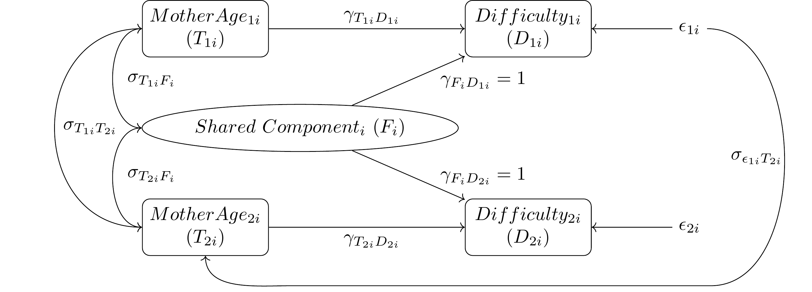
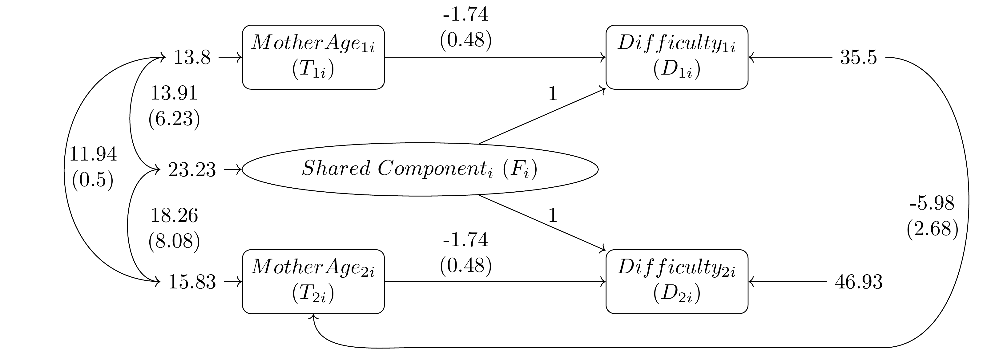

<style>
code {
   background-color: #efefef;
   font-weight: bold;
}
</style>

Reproducible Papers with rrtools
========================================================
author: Charles Lanfear
date: 4/19/2018
width: 1600
height: 900
font-family: helvetica

Before We Begin
========================================================

This presentation focuses on reproducible articles with R using
[Ben Marwick's rrtools](https://github.com/benmarwick/rrtools).

After presenting `rrtools`, it will be demonstrated using an actual research project in progress: Lanfear, C. and R. Matsueda, "A Dynamic Intrafamily Model of Child Behavior Problems and Birth Timing".

The compendium repository for this project is available at [github.com/clanfear/birthtiming](http://github.com/clanfear/birthtiming) or can be
installed and loaded as the R package `birthtiming` using the following code:

```
devtools::install_github("clanfear/birthtiming")
```
The current article draft and these slides may be viewed from the links on the project repository.

`birthtiming` has convenience functions for opening these files:
 * `birthtiming::browse_paper()` opens the paper in a browser window.
 * `birthtiming::browse_presentation()` opens the slides in a browser window.
 * `birthtiming::open_paper_dir()` *should* open the local directory with the paper draft.

-

Reproducibility
========================================================
incremental: true

Reproducibility comes in three forms (Stodden 2014):

1. Empirical: Repeatability in data collection.
2. Statistical: Verification with alternate methods of inference.
3. Computational: Reproducibility in cleaning, organizing, and presenting data and results.

R is particularly well suited to enabling **computational reproducibility**.

-

Computational Reproducibility
========================================================
incremental: true

Elements of computational reproducibility:
* Shared data
* Shared code
* Documentation
* Version Control

R packages are a convenient method of sharing data and code with documentation,
which are easily combined with tools like `git` for version control.

-

Levels of Reproducibility
========================================================
incremental: true

0. "Read the article"
1. Shared data with documentation
2. Shared data and all code
3. Dynamic document
4. **Research compendium**
5. Docker file: Self-contained ecosystem

-

Research Compendia
========================================================
incremental: true

A research compendium is an R package used not to share statistical or computational *methods* but to organize and share reproducible *projects*.

Research compendia feature:

* Files organized in a recognizable structure (R packages)
* Clear separation of data, method, and output. *Data are read only*.
* A well-documented or even *preserved* computational environment

`rrtools` provides a simplified workflow to accomplish this.

-

rrtools Benefits
========================================================
incremental: true

`rrtools` compendia facilitate:

*	Convenient public sharing of data and code
*	Increased efficiency due to organization
*	An identical setup for every project to reduce "start-up costs""
*	Integration of tools for collaboration
*	Integration of testing and documentation

You can install `rrtools` directly from GitHub:

```
devtools::install_github("benmarwick/rrtools")
```

-

rrtools Usage
========================================================
incremental: true

The simple `README` on the [`rrtools` github page](https://github.com/benmarwick/rrtools) outlines the one-time function calls used to prepare a compendium for use.

Most important of these:

* `use_compendium("pkgname")` generates a top-level project directory, subfolders, and necessary files.
* `devtools::use_github()` initializes a github repository for the project.
* `rrtools::use_readme_rmd()` generates an RMarkdown file to produce a repository README
* `rrtools::use_analysis()` creates directories and bookdown files for an article

For exact usage, see the link above.

-

rrtools Organization
========================================================
incremental: true

Use of the preceding `rrtools` functions will result in a compendium (R package) with the following structure, familiar to users who have created R packages:

* `README.md` describing the project
* `DESCRIPTION` documenting dependencies and metadata
* `inst/data/` for raw data files
* `inst/analysis/` or `inst/paper/` for scripts, reports, and makefiles
* `R/` for scripts with reusable functions
* `man/` for documentation of functions (`roxygen` suggested)

-

rrtools Workflow
========================================================
incremental: true

Once the compendium has been created, you can

* Place raw data in `inst/data/`
* Write functions in `R/` for processing data or doing analysis
* Write your article or thesis and scripts in `inst/paper/` or `inst/analysis/`
* Produce figures and save them to the `inst/figures/` directory
* Commit changes to github easily (so do it often)

By loading the compendium library at the start of the paper's `.Rmd` file, all data and functions in the other directories become available.

-

Bookdown
========================================================

If using your compendium to generate an article, thesis, or dissertation, `rrtools` makes formatting simple by integrating `bookdown`.

`bookdown` provides an easily accessible alternative to manually writing $\LaTeX$ for typesetting and reference management.

You can integratr citations from bibtex files simply by placing the `.bib` file (such as produced by Zotero) in `inst/paper/` then choosing an appropriate citation format in the `csl:` field of the header of `paper.Rmd`.

`bookdown` supports `.html` output for ease and speed and also renders `.pdf` files through $\LaTeX$ for publication-ready documents.

For University of Washington theses and dissertations, consider Ben Marwick's `huskydown` package which uses simple Markdown syntax but renders using a UW approved $\LaTeX$ template.

Final Notes on rrtools
========================================================
incremental: true


* `rrtools` provides a relatively simple framework for organizing reproducible projects.

* A small upfront investment in organization pays large dividends.

* It is **much** easier to *start* in a reproducible framework than move to one later.

* In general, reproducible frameworks reduce mistakes, improve organization, and protect work.

* There is evidence that reproducible and shared research may be more likely to be cited, and definitely contributes more to the discipline (see Marwick et al. 2017).


-

The Paper
========================================================
type: section

Lanfear, C. and R. Matsueda, "A Dynamic Intrafamily Model of Child Behavior Problems and Birth Timing"


Overview
========================================================
incremental: true

## Key Papers

### Hao & Matsueda (2006)
* Question: How does mother's age at birth impact child behavior problems?
* Young mothers report more child behavior problems independent of measured child characteristics and at-birth family conditions.
* Used a sibling fixed effects model to remove all time invariant effects
* But what if child behavior impacts future fertility decisions, such as timing of second birth? (Phillips 1999)

### Rosenzweig & Wolpin (1995)

* Question: How does teen childbearing impact birth outcomes (e.g. birth weight)?
* Used a fixed-effects instrumental variables sibling model:
   * Fixed effects remove all time-invariant mother factors
   * Error term for first child's outcomes allowed to impact mother's age at second birth
   * Accounts for decisionmaking in fertility

-

Lanfear & Matsueda 2018
========================================================

This project combines the question of Hao & Matsueda (2006) with the estimation technique of Rosenzweig & Wolpin (1995)

### Our question:

**How does mother's age at birth impact child behavior problems if we account for the possibility that child behavior impacts future fertility decisions?**

Note: Focusing on mother's age in general, not teen births.

National Longitudinal Survey of Youth 1979
========================================================
incremental: true

### Sample
* Combined mothers with child sample
* Americans age 14--21 in 1979, surveyed biennially up through 2012.
* Restricted to mothers with 2+ children, only use first two.
* Age of data means coverage of nearly *full range* of fertility.
   * Earliest first birth at 19, second at 20.
   * Oldest first birth at 40, second at 42.
* 1453 mothers with 2906 children

### Measures
* Mother's age at birth in years
* Perceived child difficulty scale (0 to 23 months): 11 items.
* *Birth characteristics* (in progress)
* *Changes in family social and economic conditions* (in progress)

-

Model
========================================================
incremental: true

### Sibling Fixed-Effects Instrumental Variables Estimator

* Mother's age at birth predicts child difficulty
* Mother's age covaries with fixed effects, fixed effects predict child difficulty
   * Purges all time-invariant effects
* First child difficulty error term covaries with mother's age at second birth

#### Key Feature:

#### *Error term of first child difficulty is instrument for effect of mother's age on second child difficulty.*

-

Model Graph
========================================================




Preliminary Results 1
========================================================

Estimates obtained using `lavaan`; unstandardized parameters with standard errors.



Discussion
========================================================
incremental: true

### Key Preliminary Findings:

* Mother's age at birth has a strong negative relationship with child difficulty
* Evidence for a *negative* feedback effect of difficulty:
   * Unusually high difficulty first children result in *earlier* second births
   * "Making up for failures"
* Tentatively, these effects appears to remain when introducing birth-time covariates

### Planned Additions:

* Introduce birth-time and time-variant mother characteristics
* Examine how child difficulty predicts hazard or censoring of subsequent births
* Test random effects specification
* Clean up code, introduce "on demand" specification tests

-

Reproducibility
========================================================
incremental: true

All data manipulation and estimation---including generation of the diagrams---occur on the fly when the `birthtiming` package compiles the paper.

### Process when paper is rendered:

1. Raw NLSY data is imported and variable names assigned
2. Data cleaned and reshaped into mother observations (`dplyr`, `reshape2`)
3. Structural equation models are fit with `lavaan` and estimates extracted.
4. `sweave` calls generate the diagrams separately ($\LaTeX$ with `tikz`)
   * PDF output from Sweave is converted on the fly to `.png` images (`pdftools`)
   * $\LaTeX$ with in-line R code is used to insert estimates into second diagram
5. Paper compiles via `bookdown` with bibtex references as either `.pdf` or `.html` (via Pandoc)

-

References
========================================================

Stodden, V. (2014), "What scientific idea is ready for retirement? Reproducibility." *Edge*. URL: https://www.edge.org/response-detail/25340

Marwick, B., Boettiger, C. & L. Mullen (2017). "Packaging data analytical work reproducibly using R (and friends)." *PeerJ Preprints* 5:e3192v1 https://doi.org/10.7287/peerj.preprints.3192v1

Hao, L. & R. Matsueda (2006). “Family Dynamics Through Childhood: A sibling model of behavior problems.” *Social Science Research 35*(2):500–524. http://www.sciencedirect.com/science/article/pii/S0049089X04001024

Rosenzweig, M. & K. Wolpin (1995). “Sisters, Siblings, and Mothers: The effect of teen-age childbearing on birth outcomes in a dynamic family context.” *Econometrica 63*(2):303–26. http://www.jstor.org/stable/2951628
